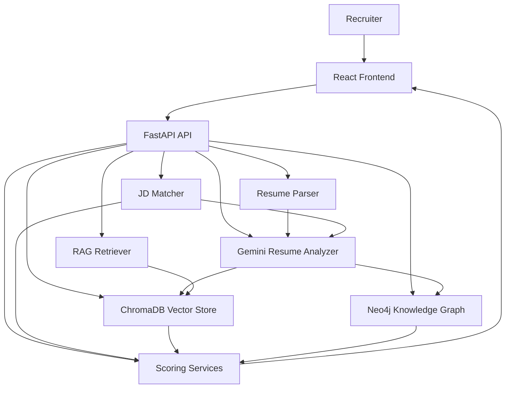

# HirePilot Architecture

## High-Level Architecture



## Component Responsibilities

### React frontend

The frontend provides recruiter-facing interfaces for candidate discovery, candidate profiles, job-description matching, interview/report workflows, and graph exploration.

### FastAPI backend

The backend exposes REST endpoints and coordinates parsing, AI analysis, retrieval, graph access, matching, and scoring.

### Resume parser

Uploaded resumes are converted into text before being passed to the structured candidate-analysis layer.

### Gemini analysis

The Gemini service converts resume text into a structured candidate profile containing fields such as:

- name
- email
- phone
- summary
- education
- skills
- experience
- projects
- strengths
- weaknesses

### ChromaDB

Resume text and candidate context are stored for semantic retrieval. Natural-language queries can retrieve candidates whose resume content is conceptually relevant even when exact keywords differ.

### Neo4j

The graph stores relationships such as:

```text
Candidate ──HAS_SKILL────> Skill
Candidate ──STUDIED_AT──> College
Candidate ──BUILT───────> Project
Project   ──USES────────> Technology
```

This creates a navigable candidate knowledge graph rather than a flat collection of resumes.

### JD Matcher

The JD matcher combines candidate information with a job description and asks the AI evaluation layer to assess skill, experience, education, and overall alignment.

### Scoring services

Deterministic and semantic signals can be combined with AI evaluation to rank candidates. The goal is to keep hard requirements reproducible while using an LLM for contextual interpretation.

---

## Resume Processing Flow

```text
PDF
 ↓
Text Extraction
 ↓
Gemini Structured Analysis
 ↓
Candidate JSON
 ├── Skills
 ├── Education
 ├── Experience
 ├── Projects
 └── Summary
 ↓
 ┌───────────────┬─────────────────┐
 ↓               ↓                 ↓
ChromaDB       Neo4j          Candidate API
 ↓               ↓                 ↓
Semantic       Graph           Profile
Search         Context
```

## JD Matching Flow

```text
Job Description
       ↓
Candidate Retrieval
       ↓
Relevant Candidate Set
       ↓
Deterministic Skill Coverage
       ↓
Project / Experience Relevance
       ↓
Gemini Qualitative Evaluation
       ↓
Final Candidate Ranking
```

## Design Principle: Deterministic + Probabilistic

HirePilot deliberately separates tasks that need deterministic behavior from tasks that benefit from language-model reasoning.

### Prefer deterministic logic for

- file validation
- authentication and authorization
- hard skill checks
- numeric scoring rules
- input constraints
- database permissions
- API validation

### Use an LLM for

- resume information extraction
- contextual project relevance
- qualitative JD alignment
- recruiter-style explanations
- natural-language reasoning

This separation makes the system easier to test, debug, and evaluate.
